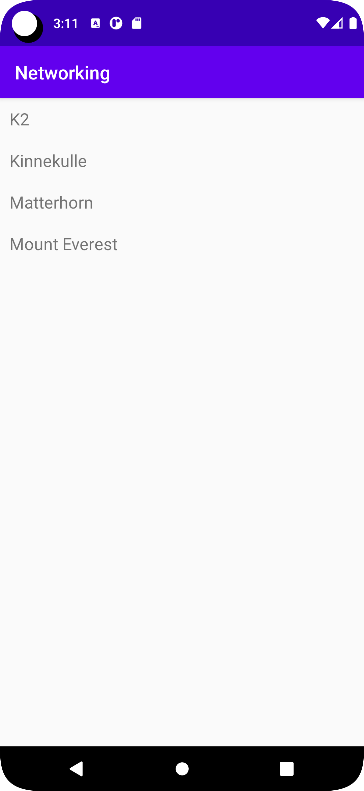

# Rapport
jag började med att lägga till en recycelVeiw i activety_main.xml filen
````
<androidx.recyclerview.widget.RecyclerView
        android:id="@+id/recycler_view"
        android:layout_width="match_parent"
        android:layout_height="match_parent"
        app:layout_constraintBottom_toBottomOf="parent"
        app:layout_constraintLeft_toLeftOf="parent"
        app:layout_constraintRight_toRightOf="parent"
        app:layout_constraintTop_toTopOf="parent"
        app:layoutManager="androidx.recyclerview.widget.LinearLayoutManager"/>

````
sedna gick jag vidare med att skapa min Arraylist med tillhörande klass 
````
ArrayList<Mountain> mList;

public class Mountain {
    private String name;
    private String ID;
    private int meter;
    public Mountain(String name, String id, int meter) {
        this.name = name;
        this.ID = ID;
        this.meter = meter;
    }
    public String getName(){
        return name;
    }
    public String getID(){
        return ID;
    }
    public int getMeter(){
        return meter;
    }
}
````
efter detta kom jag till till det största problemet att skapa RecyclerViewAdapter som jag inte hittade de filerna tilla och försökte skapa en själv från grunden
detta gick sådär som man kanske kan förstå och jag krånglade en hel del med dett och gick under en tid vidare med att göra så appen hade tillgång till internet.
och fixa andra saker så som JSON URlen och utöka min mountain class.

````
<uses-permission android:name="android.permission.INTERNET" />

 private final String JSON_URL = "https://mobprog.webug.se/json-api?login=brom";
 
````
efter detta med lite hjälp hitta jag tillslut sidan med RecyclerViewAdapter och annat och lykades där efter skapa den ordentligt och fixa de endringar som behövdes.
sedan ochså skapa en ny xml fil för att han så listan syntes i appen.

````
<?xml version="1.0" encoding="utf-8"?>
<LinearLayout xmlns:android="http://schemas.android.com/apk/res/android"
    android:layout_width="match_parent"
    android:layout_height="wrap_content"
    android:orientation="horizontal"
    android:padding="10dp">

    <TextView
        android:id="@+id/title"
        android:layout_width="wrap_content"
        android:layout_height="wrap_content"
        android:textSize="18sp"/>

</LinearLayout>

````

efter detta var det bara felsökandet kvar och och efter mycket om och men hitta jag tillslut varför den inte fick fram dtan i programmet 
och det visade sig att jag hade glömt lägga till
````
app:layoutManager="androidx.recyclerview.widget.LinearLayoutManager"/>
````

efter det fungerade appen som den skulle.



